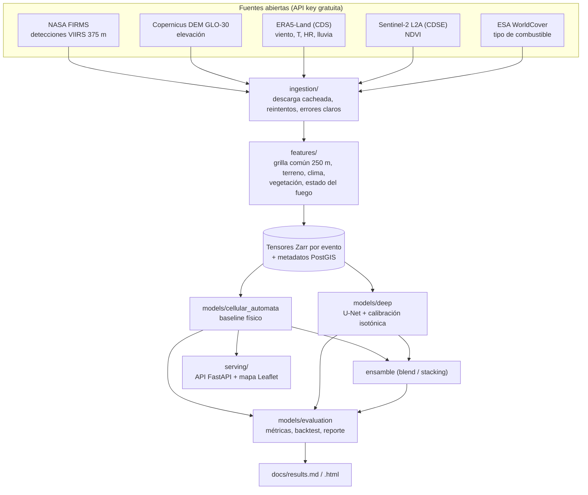

# PyroCast

> ## ⚠️ Herramienta de investigación
> **Herramienta de investigación. No usar para decisiones operativas de
> combate de incendios sin validación de CONAF/SENAPRED.**
> Es un proyecto de investigación / portafolio académico de una persona. Sus
> resultados son preliminares, se evaluaron con muy pocos incendios reales y
> no hay ninguna validación operativa. Ver [Resultados](#resultados) y
> [`docs/limitations.md`](docs/limitations.md).

Sistema de pronóstico de propagación de incendios forestales mediante fusión
de datos satelitales y meteorológicos abiertos (Biobío, Ñuble, La Araucanía,
Chile). Dado un punto de ignición (o un incendio activo detectado) estima la
probabilidad de que el fuego alcance cada celda de 250 m en los días
siguientes, con un autómata celular físico simple como referencia y un U-Net
como mejora, ambos evaluados contra incendios reales.

## Por qué importa

Los incendios forestales del centro-sur de Chile son una amenaza estructural.
La temporada 2025-2026 fue de las más graves de la historia del país: según el
[reporte de situación N°3 de Naciones Unidas en Chile](https://chile.un.org/es/309462-incendios-forestales-2026-reporte-de-situaci%C3%B3n-n%C2%B03)
(4 de febrero de 2026), los incendios de enero consumieron **más de 34.000
hectáreas** (31.826 en Biobío, el 92 %), causaron **21 fallecidos**, destruyeron
**más de 4.100 viviendas** y dejaron cerca de 22.000 personas damnificadas en
Biobío, Ñuble y La Araucanía. Otras fuentes dan cifras de hectáreas mayores
según la fecha de corte (p. ej. más de 38.000-41.000 ha reportadas por CONAF
hacia el 20-21 de enero, según la
[entrada de Wikipedia](https://es.wikipedia.org/wiki/Incendios_forestales_en_%C3%91uble_y_Biob%C3%ADo_de_2026));
las cifras se actualizaron durante la emergencia y esas fuentes son
secundarias. Las cifras de arriba son las del reporte de la ONU.

La tesis del proyecto es que el problema no es la falta de tecnología sino que
los datos (terreno, clima, vegetación, detecciones activas) están dispersos.
PyroCast los integra en un solo pipeline reproducible hecho solo con fuentes
abiertas y gratuitas. Es una tesis de diseño del autor, no un resultado
demostrado.

## Arquitectura



CRS de trabajo EPSG:32719 (UTM 19S), resolución espacial 250 m y temporal
diaria. Es una simplificación deliberada frente a la literatura (WildfireCube
usa 30 m / 3 h); no es equivalente. Detalle en [`CLAUDE.md`](CLAUDE.md) y
[`docs/decisions.md`](docs/decisions.md).

## Resultados

<!-- results-summary:start (generado por `make report`, no editar a mano) -->
| Modelo | IoU ↑ | Dice ↑ | Brier ↓ | ECE ↓ |
|---|---|---|---|---|
| Autómata celular (sin calibrar) | 0.380 | 0.538 | 0.110 | 0.105 |
| U-Net (calibrado) | 0.563 | 0.720 | 0.076 | 0.070 |
| Ensamble: blend | 0.562 | 0.720 | 0.064 | 0.047 |
| Ensamble: stacking | 0.527 | 0.690 | 0.075 | 0.121 |

Backtest sobre incendios reales de Chile 2025-2026, media sobre **2 eventos de test**. Con tan pocos eventos **no es una comparación estadísticamente robusta**: ningún modelo queda demostrado como mejor. Intervalos, mapas, calibración y análisis de fallas en [`docs/results.md`](docs/results.md).
<!-- results-summary:end -->

Honestidad por adelantado: el U-Net se entrenó desde cero con muy pocos eventos
reales (sin preentrenamiento), el autómata celular no está calibrado contra
incendios reales y el conjunto de test es mínimo. Los números ilustran
que el pipeline funciona de punta a punta con datos reales, no que un modelo
sea mejor que otro. **Modelo servido por defecto: autómata celular** (motivos
en [`docs/backtest-2026.md`](docs/backtest-2026.md), sección 8).

## Instalación

Requisitos: [`uv`](https://docs.astral.sh/uv/) (instala Python 3.12 solo) y
`make`. Docker es opcional (PostGIS y la imagen de la API).

```bash
git clone <este repositorio> && cd PyroCast
uv sync --all-packages --group dev
cp .env.example .env     # se completa solo para la demo real (abajo)
```

## Demo end-to-end con datos de fixture (sin credenciales)

Todo esto corre sin cuentas ni red, con datos sintéticos o con los resultados
ya versionados en `bench/results/`:

```bash
make test lint typecheck     # toda la suite, sin credenciales reales
make run-ca                  # autómata celular sobre un evento de fixture
make calibrate               # entrena un U-Net diminuto de fixture y lo calibra
make report                  # regenera docs/results.md y .html desde bench/results/
make demo                    # API + mapa con datos SINTÉTICOS en http://127.0.0.1:8000
```

Con `make demo`, abre <http://127.0.0.1:8000>, haz clic en el mapa cerca del
centro (lat -37.5, lon -72.5), deja la fecha por defecto (2026-01-10) y pulsa
"Predecir propagación". Verás celdas coloreadas por probabilidad acumulada y un
deslizador por día. Son datos inventados (terreno plano, pastizal, viento
constante): sirven solo para ver el sistema funcionar. En esta demo
`/active-fires` falla con un mensaje claro porque no hay una clave de FIRMS
real. Comprobación sin navegador:

```bash
curl -s http://127.0.0.1:8000/healthz
curl -s -X POST http://127.0.0.1:8000/predict -H 'Content-Type: application/json' \
  -d '{"lat": -37.5, "lon": -72.5, "date": "2026-01-10", "horizon_days": 3}'
```

## Credenciales gratuitas, paso a paso

Todas las fuentes son abiertas pero requieren registro. Las claves van en
`.env` (ignorado por git; **nunca** las commitees ni las pegues en issues o
logs). Los enlaces y menús son los vigentes al 2026-10-01 y pueden cambiar.

1. **NASA FIRMS (`FIRMS_MAP_KEY`)**: entra a
   <https://firms.modaps.eosdis.nasa.gov/api/map_key/>, escribe tu correo y
   elige "Get MAP_KEY"; la clave llega por email. Pégala en `.env`. Límite:
   5000 transacciones / 10 min por clave.
2. **Copernicus Climate Data Store (`CDS_API_URL`, `CDS_API_KEY`)**: crea una
   cuenta en <https://cds.climate.copernicus.eu/>, abre tu perfil y copia el
   "Personal Access Token". **Antes de descargar**, abre la página del dataset
   [ERA5-Land hourly](https://cds.climate.copernicus.eu/datasets/reanalysis-era5-land),
   pestaña "Download", y acepta los términos de uso al final (sin eso las
   solicitudes fallan). Deja `CDS_API_URL=https://cds.climate.copernicus.eu/api`.
3. **Copernicus Data Space Ecosystem (`COPERNICUS_DATASPACE_CLIENT_ID`,
   `COPERNICUS_DATASPACE_CLIENT_SECRET`)**: regístrate en
   <https://dataspace.copernicus.eu/>, entra al
   [dashboard de Sentinel Hub](https://shapps.dataspace.copernicus.eu/dashboard/)
   con la misma cuenta, abre la configuración de usuario y crea un cliente
   OAuth ("OAuth clients"). Copia el ID y el *secret* (este último solo se
   muestra una vez).
4. **ESA WorldCover y Copernicus DEM**: no necesitan credenciales (buckets
   públicos de AWS por HTTPS).
5. **Kaggle (opcional)**: solo para preentrenar con el dataset público NDWS
   (ver [`docs/public-dataset.md`](docs/public-dataset.md)); los resultados de
   este repositorio **no** lo usaron.

PostgreSQL/PostGIS (`POSTGRES_*`) trae valores de desarrollo en
`.env.example`; se levanta con `make up`.

## Demo real (con credenciales)

Con `.env` completo y PostGIS arriba (`make up`). Ejemplo con la ventana de
enero de 2026 y un bbox acotado alrededor de un evento (el bbox de estudio
completo excede el límite de píxeles de un job síncrono de openEO; ver
[`docs/limitations.md`](docs/limitations.md)):

```bash
make ingest-firms   START=2026-01-10 END=2026-01-31
make ingest-terrain                                   # DEM + pendiente/orientación
make ingest-weather START=2026-01-05 END=2026-01-31   # ERA5-Land (puede tardar horas en cola)
make ingest-vegetation YEAR=2026 MONTH=1              # Sentinel-2 + WorldCover
make build-dataset  START=2026-01-10 END=2026-01-31   # tensores por evento + split
uv run --package models pyrocast-train finetune --run-dir runs/finetune
uv run --package models pyrocast-calibrate run --checkpoint runs/finetune/best.pt --chile-val
uv run --package models pyrocast-models backtest --model unet --checkpoint runs/finetune/best.pt
make backtest report-artifacts report
make serve                                            # http://127.0.0.1:8000, /docs activo
```

La reproducción exacta de los resultados publicados (eventos elegidos,
comandos, commits) está en [`docs/backtest-2026.md`](docs/backtest-2026.md)
sección 9 y en [`docs/results.md`](docs/results.md) sección 7. Si una fuente
se cae o se agota una cuota, el comando termina con un mensaje que nombra la
fuente y qué hacer, y lo ya descargado queda en caché.

## API

`POST /predict`, `GET /active-fires`, `GET /healthz` y el mapa en `/`. Todas
las predicciones llevan `research_tool: true` y una referencia a
`docs/limitations.md`. Detalle, formato de errores y caché en
[`docs/api.md`](docs/api.md). Por defecto la API corre en modo `production`
(sin `/docs`, sin CORS, cabeceras de seguridad); `make serve` y `make demo`
usan `ENVIRONMENT=development`.

## Comandos

`make test lint typecheck audit` (el último corre `pip-audit` sobre
`uv.lock`), `make up/down`, `make ingest-*`, `make build-dataset`,
`make run-ca`, `make calibrate`, `make backtest`, `make report`,
`make report-artifacts`, `make serve`, `make demo`. Lista completa en el
[`Makefile`](Makefile) y en [`CLAUDE.md`](CLAUDE.md).

## Estructura

```
shared/      configuración, esquemas, protocolo de modelo
ingestion/   clientes de las 5 fuentes abiertas (reintentos, cuotas, errores claros)
features/    grilla, terreno, clima, vegetación, estado del fuego, dataset por evento
models/      cellular_automata/, deep/ (U-Net, calibración, ensamble), evaluation/ (backtest, reporte)
serving/     API FastAPI + mapa web (Jinja2 + Leaflet)
bench/       resultados de backtest versionados (de ahí sale docs/results.md)
docs/        decisiones, limitaciones, fuentes de datos, API, resultados
```

## Datos, licencias y atribución

Todas las fuentes son abiertas, y este repositorio **no redistribuye datos**
(`data/` está ignorado). Cualquier resultado o mapa derivado debe llevar las
atribuciones de cada fuente; el detalle (licencia, texto de atribución exacto,
citas y qué se verificó) está en
[`docs/data-sources.md`](docs/data-sources.md#licencias-y-atribución-resumen).

| Fuente | Licencia | Atribución mínima |
|---|---|---|
| NASA FIRMS (VIIRS 375 m) | Datos abiertos NASA | "We acknowledge the use of data and/or imagery from NASA's Fire Information for Resource Management System (FIRMS) (https://earthdata.nasa.gov/firms), part of NASA's Earth Science Data and Information System (ESDIS)." |
| Copernicus DEM GLO-30 | Licencia Copernicus DEM (uso libre) | "produced using Copernicus WorldDEM-30 © DLR e.V. 2010-2014 and © Airbus Defence and Space GmbH 2014-2018 provided under COPERNICUS by the European Union and ESA; all rights reserved" |
| ERA5-Land (CDS) | CC BY 4.0 | Muñoz Sabater, J. (2019), ERA5-Land hourly data, C3S CDS, [doi:10.24381/cds.e2161bac](https://doi.org/10.24381/cds.e2161bac) · "Generated using Copernicus Climate Change Service information" |
| Sentinel-2 L2A (CDSE) | Datos Sentinel de Copernicus (libre, completo y abierto) | "Contains modified Copernicus Sentinel data [año]" |
| ESA WorldCover 10 m 2021 v200 | CC BY 4.0 | "© ESA WorldCover project 2021 / Contains modified Copernicus Sentinel data (2021) processed by ESA WorldCover consortium" · Zanaga et al. (2022), [doi:10.5281/zenodo.7254221](https://doi.org/10.5281/zenodo.7254221) |
| Next Day Wildfire Spread (NDWS, opcional) | CC BY 4.0 | Huot et al. (2022), *IEEE TGRS* 60 — no usado en los resultados publicados |
| Teselas del mapa (interfaz web): Esri World Dark Gray Base | Términos de uso de Esri (sin clave; no verificados a fondo) y ODbL para los datos de OpenStreetMap | "Esri, HERE, Garmin, © OpenStreetMap contributors, and the GIS user community" |

Paper de referencia de diseño: WildfireCube (ver
[`CLAUDE.md`](CLAUDE.md) y [`docs/decisions.md`](docs/decisions.md)). Licencia del código de este
repositorio: **pendiente de definir por el autor** (no hay un archivo
`LICENSE` todavía).

## Documentación

[`CLAUDE.md`](CLAUDE.md) (alcance y convenciones) ·
[`docs/limitations.md`](docs/limitations.md) (limitaciones, consolidadas) ·
[`docs/results.md`](docs/results.md) (resultados) ·
[`docs/backtest-2026.md`](docs/backtest-2026.md) ·
[`docs/api.md`](docs/api.md) ·
[`docs/data-sources.md`](docs/data-sources.md) ·
[`docs/decisions.md`](docs/decisions.md) ·
[`docs/model-card.md`](docs/model-card.md) ·
[`docs/dataset-card.md`](docs/dataset-card.md)
