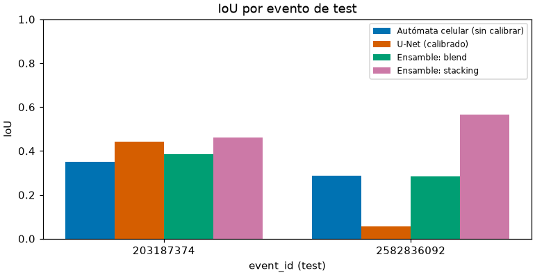
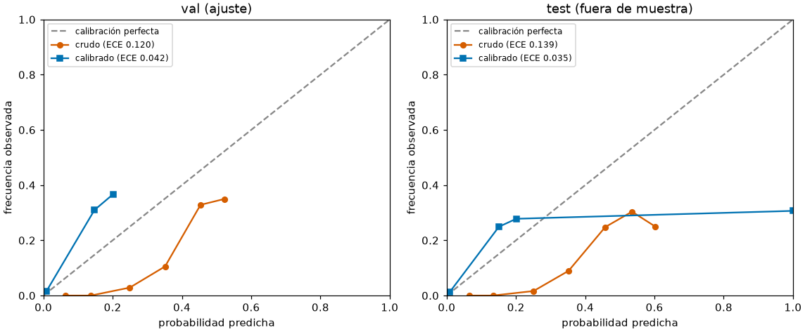
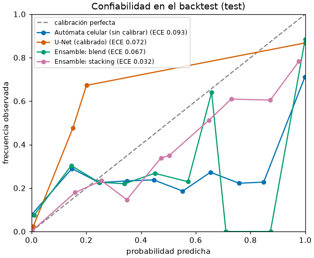
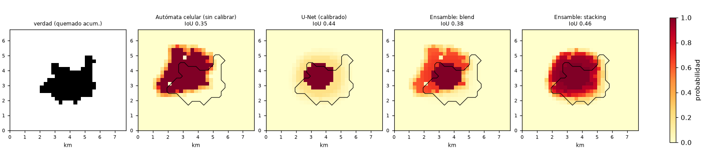
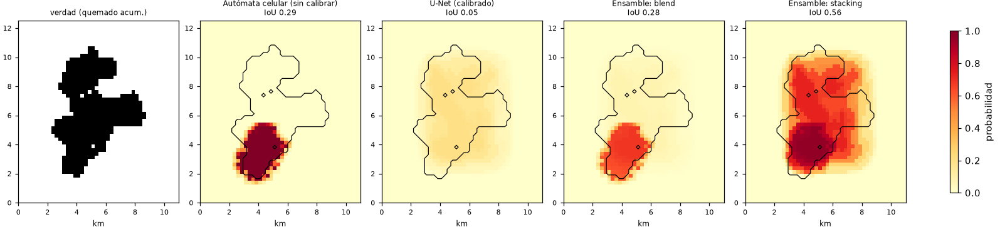
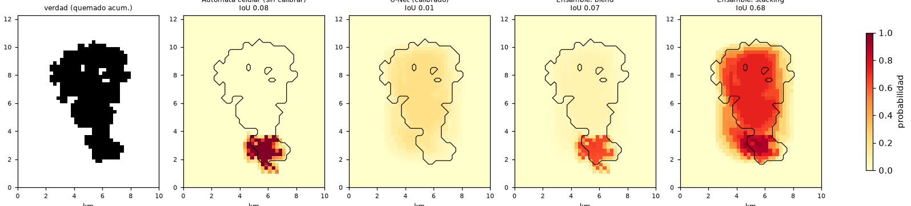
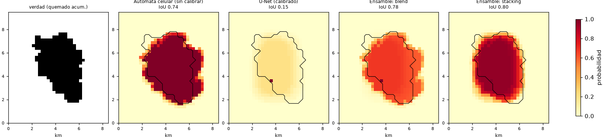

# Resultados de PyroCast

**Herramienta de investigación. No usar para decisiones operativas de combate de incendios sin validación de CONAF/SENAPRED.**

> Este documento lo genera `make report` a partir de `bench/results/` y `docs/`. Ningún número se escribió a mano. Léanse junto con `docs/limitations.md`.

## 1. Resumen

Backtest sobre el split de test de incendios reales de Chile 2025-2026 (n = 2 eventos de test). Modelos con resultados: Autómata celular (sin calibrar), U-Net (calibrado), Ensamble: blend, Ensamble: stacking.

- IoU ↑: mejor Ensamble: stacking (0.513 [0.462, 0.564]); intervalo sin solape con los demás modelos.
- Dice ↑: mejor Ensamble: stacking (0.677 [0.632, 0.722]); intervalo sin solape con los demás modelos.
- Brier ↓: mejor Ensamble: stacking (0.058 [0.056, 0.061]); intervalo solapado con U-Net (calibrado), Ensamble: blend: **diferencia no distinguible** con este n.
- ECE ↓: mejor Ensamble: stacking (0.038 [0.020, 0.055]); intervalo solapado con U-Net (calibrado): **diferencia no distinguible** con este n.

Con tan pocos eventos de test los intervalos bootstrap (remuestreo de valores por evento) son anchos o, con n pequeño, engañosamente angostos: **esto no es una comparación estadísticamente robusta**. Ver las secciones 2 y 5.

## 2. Tabla comparativa

### 2.1 Backtest real 2026 (P12) y ensambles (P13)

| Métrica (media [IC 95 % bootstrap]) | Autómata celular (sin calibrar) | U-Net (calibrado) | Ensamble: blend | Ensamble: stacking |
|---|---|---|---|---|
| IoU ↑ | 0.319 [0.288, 0.351] | 0.249 [0.055, 0.442] | 0.334 [0.284, 0.384] | 0.513 [0.462, 0.564] |
| Dice ↑ | 0.483 [0.447, 0.520] | 0.359 [0.104, 0.613] | 0.499 [0.442, 0.555] | 0.677 [0.632, 0.722] |
| Brier ↓ | 0.092 [0.082, 0.103] | 0.070 [0.044, 0.096] | 0.075 [0.058, 0.092] | 0.058 [0.056, 0.061] |
| ECE ↓ | 0.091 [0.082, 0.100] | 0.064 [0.035, 0.094] | 0.074 [0.058, 0.090] | 0.038 [0.020, 0.055] |

### 2.2 Test interno (P8)

El 'split de test interno' del dataset de eventos de Chile **es** el conjunto evaluado en 2.1: `features.dataset.split` reserva esos eventos por evento (nunca por píxel) y el backtest los usa. **No existe en `bench/results/` ningún resultado de un test interno distinto** (p. ej. sobre el dataset público NDWS, que el U-Net nunca vio: se entrenó solo con eventos de Chile). No se rellena con números de fixtures sintéticos.

### 2.3 Por evento

| event_id | modelo | IoU ↑ | Dice ↑ | Brier ↓ | ECE ↓ |
|---|---|---|---|---|---|
| 203187374 | Autómata celular (sin calibrar) | 0.351 | 0.520 | 0.082 | 0.082 |
| 203187374 | U-Net (calibrado) | 0.442 | 0.613 | 0.044 | 0.035 |
| 203187374 | Ensamble: blend | 0.384 | 0.555 | 0.058 | 0.058 |
| 203187374 | Ensamble: stacking | 0.462 | 0.632 | 0.061 | 0.055 |
| 2582836092 | Autómata celular (sin calibrar) | 0.288 | 0.447 | 0.103 | 0.100 |
| 2582836092 | U-Net (calibrado) | 0.055 | 0.104 | 0.096 | 0.094 |
| 2582836092 | Ensamble: blend | 0.284 | 0.442 | 0.092 | 0.090 |
| 2582836092 | Ensamble: stacking | 0.564 | 0.722 | 0.056 | 0.020 |



*IoU por evento de test y modelo (datos de bench/results/).*

## 3. Calibración

### 3.1 U-Net: antes / después de la calibración isotónica (P11)

| conjunto | n celdas | Brier antes | Brier después | ECE antes | ECE después |
|---|---|---|---|---|---|
| val (conjunto de AJUSTE del calibrador) | 13008 | 0.0795 | 0.0667 | 0.1200 | 0.0421 |
| test (fuera de muestra) | 10785 | 0.0758 | 0.0619 | 0.1394 | 0.0350 |

Pares (entrada del día d, máscara del día d+1) de un solo paso, el mismo contrato con que se entrenó y calibró. **El ECE 'después' sobre val es estructuralmente ~0** (el calibrador se ajusta sobre esos mismos datos, `docs/calibration.md`): solo la fila de test mide calibración fuera de muestra.



*Diagramas de confiabilidad del U-Net, crudo vs. calibrado.*

### 3.2 Los cuatro modelos en el backtest (predicción acumulada multi-día)



*Confiabilidad de cada modelo sobre los eventos de test (misma convención acumulada que las métricas de 2.1).*

| modelo | Brier | ECE |
|---|---|---|
| Autómata celular (sin calibrar) | 0.0951 | 0.0933 |
| U-Net (calibrado) | 0.0771 | 0.0725 |
| Ensamble: blend | 0.0792 | 0.0673 |
| Ensamble: stacking | 0.0577 | 0.0317 |

## 4. Predicciones contra el incendio real

**Criterio de selección: ninguno que favorezca al modelo.** Se muestran *todos* los eventos retenidos (no vistos al entrenar los pesos): los de **test** (evidencia fuera de muestra) y los de **val** (con rótulo: val se usó para calibrar el U-Net y elegir el peso/coeficientes del ensamble, así que NO es evidencia fuera de muestra). Cada caso se rotula 'bueno' o 'malo' según el IoU del U-Net, calculado de los datos. Cada panel muestra el último día del horizonte; el contorno negro es el área realmente quemada acumulada.

### Evento 203187374 (test) — caso bueno para U-Net (calibrado) (IoU 0.442)



*Evento 203187374 (test): verdad acumulada y probabilidad predicha por modelo, último día.*

### Evento 2582836092 (test) — caso malo para U-Net (calibrado) (IoU 0.055)



*Evento 2582836092 (test): verdad acumulada y probabilidad predicha por modelo, último día.*

### Evento 12676775 (val) — caso malo para U-Net (calibrado) (IoU 0.007)



*Evento 12676775 (val): verdad acumulada y probabilidad predicha por modelo, último día.*

### Evento 2728181583 (val) — caso malo para U-Net (calibrado) (IoU 0.151)



*Evento 2728181583 (val): verdad acumulada y probabilidad predicha por modelo, último día.*

## 5. Dónde falla el modelo

Se analizan todos los pares modelo-evento retenidos con **IoU < 0.30** (umbral fijo de este reporte, no ajustado a los resultados), agrupados por evento. Se comparan descriptores del evento contra los 11 eventos de entrenamiento. **Las hipótesis NO están verificadas**: con tan pocos eventos no se puede aislar una causa.

### Evento 2582836092 (test)

- Autómata celular (sin calibrar): IoU 0.288, Dice 0.447, Brier 0.103; celdas con prob ≥ 0,5 en el último día: 147 frente a 460 realmente quemadas (razón 0.32) — **subpredice**.
- U-Net (calibrado): IoU 0.055, Dice 0.104, Brier 0.096; celdas con prob ≥ 0,5 en el último día: 0 frente a 460 realmente quemadas (razón 0.00) — **subpredice**.
- Ensamble: blend: IoU 0.284, Dice 0.442, Brier 0.092; celdas con prob ≥ 0,5 en el último día: 132 frente a 460 realmente quemadas (razón 0.29) — **subpredice**.

Descriptores del evento frente a los eventos de entrenamiento:

- celdas realmente quemadas (último día): 460; entrenamiento 62–4080; percentil 73
- variabilidad de la dirección diaria del viento (desv. circular, °): 7.82; entrenamiento 1.64–84.71; percentil 18 (bajo frente al entrenamiento)
- velocidad media del viento (m/s): 3.51; entrenamiento 1.17–5.43; percentil 82 (alto frente al entrenamiento)
- desv. estándar de la elevación (m): 72.23; entrenamiento 8.78–267.96; percentil 64
- pendiente media (°): 5.24; entrenamiento 0.55–17.55; percentil 82 (alto frente al entrenamiento)
- fracción de celdas no combustibles: 0.00; entrenamiento 0.00–0.21; percentil 9 (bajo frente al entrenamiento)

**Hipótesis respaldadas por los descriptores** (no verificadas):

- terreno más complejo que en la mayoría de los eventos de entrenamiento: la propagación depende de la pendiente/elevación y a 250 m se resuelve de forma gruesa (pendiente media (°): 5.24).
- viento más intenso que en la mayoría de los eventos de entrenamiento: régimen poco representado (velocidad media del viento (m/s): 3.51).

Para el U-Net, la subpredicción sistemática es coherente con un modelo entrenado desde cero con muy pocos eventos (sin preentrenamiento), que no aprendió a propagar el fuego: hipótesis, sin experimento que la aísle.

### Evento 12676775 (val) — val: no es evidencia fuera de muestra

- Autómata celular (sin calibrar): IoU 0.084, Dice 0.156, Brier 0.145; celdas con prob ≥ 0,5 en el último día: 62 frente a 446 realmente quemadas (razón 0.14) — **subpredice**.
- U-Net (calibrado): IoU 0.007, Dice 0.013, Brier 0.111; celdas con prob ≥ 0,5 en el último día: 0 frente a 446 realmente quemadas (razón 0.00) — **subpredice**.
- Ensamble: blend: IoU 0.073, Dice 0.136, Brier 0.127; celdas con prob ≥ 0,5 en el último día: 51 frente a 446 realmente quemadas (razón 0.11) — **subpredice**.

Descriptores del evento frente a los eventos de entrenamiento:

- celdas realmente quemadas (último día): 446; entrenamiento 62–4080; percentil 73
- variabilidad de la dirección diaria del viento (desv. circular, °): 33.25; entrenamiento 1.64–84.71; percentil 73
- velocidad media del viento (m/s): 3.80; entrenamiento 1.17–5.43; percentil 91 (alto frente al entrenamiento)
- desv. estándar de la elevación (m): 55.54; entrenamiento 8.78–267.96; percentil 64
- pendiente media (°): 3.58; entrenamiento 0.55–17.55; percentil 64
- fracción de celdas no combustibles: 0.11; entrenamiento 0.00–0.21; percentil 73

**Hipótesis respaldadas por los descriptores** (no verificadas):

- viento más intenso que en la mayoría de los eventos de entrenamiento: régimen poco representado (velocidad media del viento (m/s): 3.80).

Para el U-Net, la subpredicción sistemática es coherente con un modelo entrenado desde cero con muy pocos eventos (sin preentrenamiento), que no aprendió a propagar el fuego: hipótesis, sin experimento que la aísle.

### Evento 2728181583 (val) — val: no es evidencia fuera de muestra

- U-Net (calibrado): IoU 0.151, Dice 0.263, Brier 0.116; celdas con prob ≥ 0,5 en el último día: 1 frente a 278 realmente quemadas (razón 0.00) — **subpredice**.

Descriptores del evento frente a los eventos de entrenamiento:

- celdas realmente quemadas (último día): 278; entrenamiento 62–4080; percentil 64
- variabilidad de la dirección diaria del viento (desv. circular, °): 22.22; entrenamiento 1.64–84.71; percentil 55
- velocidad media del viento (m/s): 4.15; entrenamiento 1.17–5.43; percentil 91 (alto frente al entrenamiento)
- desv. estándar de la elevación (m): 90.68; entrenamiento 8.78–267.96; percentil 64
- pendiente media (°): 4.26; entrenamiento 0.55–17.55; percentil 73
- fracción de celdas no combustibles: 0.02; entrenamiento 0.00–0.21; percentil 27

**Hipótesis respaldadas por los descriptores** (no verificadas):

- viento más intenso que en la mayoría de los eventos de entrenamiento: régimen poco representado (velocidad media del viento (m/s): 4.15).

Para el U-Net, la subpredicción sistemática es coherente con un modelo entrenado desde cero con muy pocos eventos (sin preentrenamiento), que no aprendió a propagar el fuego: hipótesis, sin experimento que la aísle.

## 6. Limitaciones

Consolidado desde `docs/limitations.md` (ahí está el detalle completo y cada hallazgo con su fecha).

- **Resolución 250 m / diaria en vez de 30 m / 3 h** — *Resolución espacio-temporal reducida frente a la literatura*: el paper de referencia (WildfireCube) trabaja a 30 m / 3 h. PyroCast usa 250 m / diario por ser un proyecto de una sola persona; esto es una simplificación deliberada, no una réplica del estado del arte, y los resultados no son directamente comparables a los de ese paper.
- **Downscaling de ERA5-Land (~9 km → 250 m)** — *Resolución de ERA5-Land vs. grilla de trabajo*: ERA5-Land tiene resolución nativa de ~9 km. `features/weather/derive.py` la reproyecta y remuestrea a la grilla de 250 m del proyecto mediante interpolación bilineal — un downscaling puramente geométrico, **no** una modelación física de procesos atmosféricos de sub-grilla. Los campos de viento/temperatura/humedad/precipitación tendrán variabilidad espacial artificialmente suave dentro de cada celda de 9 km original; la variabilidad real por debajo de esa escala simplemente no está en los datos de origen. […]
- **Reconstrucción simplificada del estado del fuego** — *Reconstrucción de eventos de incendio: buffer + interpolación lineal, no kriging*: `features/fire_state/` reconstruye la extensión ACTIVA de fuego diaria de un evento (no la superficie quemada acumulada — cada máscara diaria es independiente, no incluye lo ya quemado en días anteriores) con un buffer espacial fijo alrededor de cada detección FIRMS más interpolación temporal lineal (equivalente a unión de máscaras) entre días con detección — WildfireCube (paper de referencia) usa kriging espaciotemporal, que estima incertidumbre espacial y produce una reconstrucción más plausible físicamente. […]
- **Dependencia de un dataset público externo para preentrenar** — *`models/deep/tfrecord_reader.py` nunca se probó contra un archivo real descargado de Kaggle*: -- este entorno no tiene acceso de red para descargarlo. Verificado en tres niveles distintos (ver `docs/public-dataset.md` para el detalle): el CRC32C y su fórmula de máscara están verificados contra el vector de control ESTÁNDAR de la especificación (no solo contra el encoder de test propio, que duplica la misma implementación y por eso no podía por sí solo detectar un polinomio o máscara incorrectos -- corregido en la revisión final del 2026-09-28, antes solo había verificación por round-trip); […]
- **Ausencia de validación operativa con CONAF/SENAPRED** — `docs/limitations.md` declara que esta es una herramienta de investigación y que cualquier uso operativo requiere validación de CONAF/SENAPRED; no se hizo ninguna validación operativa.

**Además** (de la evaluación, no solo del diseño): n = 2 eventos de test; autómata celular sin calibrar contra incendios reales; U-Net entrenado desde cero con eventos de Chile; pesos del ensamble ajustados sobre un val que también calibró el U-Net. Ver `docs/backtest-2026.md` y `docs/limitations.md`.

`docs/limitations.md` registra 62 limitaciones en total. Títulos:

- Resolución de ERA5-Land vs. grilla de trabajo
- Humedad relativa de ERA5-Land es aproximada, no medida
- Resolución espacio-temporal reducida frente a la literatura
- `bbox` de eventos como texto libre en `fire_event`
- Permisos del volumen `./data` en Linux
- DEM: salida no recortada al bbox exacto ni anclada a una grilla canónica
- DEM: bordes de huecos de datos no confiables
- `docker compose up` no verificado end-to-end
- Vegetación (Sentinel-2/NDVI): escala a 10 m no probada contra el bbox de estudio real
- Fuel-type: áreas urbanas asumidas no combustibles
- Reconstrucción de eventos de incendio: buffer + interpolación lineal, no kriging
- El buffer de rasterización es un radio de 375 m, no el "tamaño de píxel"
- El "encadenamiento" (chaining) del clustering no tiene límite temporal ni espacial acotado por evento
- Parámetros de clustering de eventos sin calibrar contra incendios reales
- `features/dataset/`: un único DEM/estudio de área asumido
- `features/dataset/`: canales sin cobertura se rellenan con NaN, sin error explícito
- `features/dataset/`: cada evento tiene su propia grilla, no la grilla de estudio completa
- `features/dataset/`: `pyrocast-features build-dataset` no es transaccional entre eventos
- `features/dataset/`: deduplicación de detecciones FIRMS no verificada contra datos reales
- Autómata celular: sin modelo de extinción/consumo de combustible
- Autómata celular: parámetros libres sin calibrar contra incendios reales
- `calibrate.py` solo calibra los tres parámetros escalares
- `calibrate.py`'s scoring de un solo paso
- `calibrate.py` con métrica IoU y un `TrainingSample` de un solo paso NO recupera el valor exacto de `base_spread_prob`
- 8 direcciones (vecindad de Moore), no propagación continua
- Autómata celular: `np.clip(p_dir, 0.0, 1.0)` satura a spread CIERTO en condiciones reales de incendios chilenos, no solo en casos extremos de laboratorio
- `simulate_fire_spread` rechaza `elevation`/`wind_u`/`wind_v` no finitos (NaN/inf) con un error explícito
- Backtest: la evaluación del día 0 es tautológica por construcción
- Bootstrap del backtest remuestrea valores por evento, no eventos reales ni píxeles
- `ece_score` con probabilidades sin calibrar en absoluto
- El autómata celular sigue sin modelar extinción, y el backtest ya no penaliza esa simplificación como si fuera un error adicional (pero la simplificación en sí sigue ahí)
- Acumular detecciones FIRMS día a día como proxy de "superficie quemada acumulada" no es lo mismo que la superficie quemada acumulada real
- La humedad relativa derivada de NDWS asume presión estándar a nivel del mar (101325 Pa), no la presión real de cada ubicación
- `fuel_type` de las muestras de NDWS es SIEMPRE "desconocido" (código 99)
- `models/deep/tfrecord_reader.py` nunca se probó contra un archivo real descargado de Kaggle
- El nombre exacto de los archivos dentro del zip de Kaggle no se pudo confirmar
- El decodificador protobuf de `tfrecord_reader.py` no soporta `float_list` no empaquetado (wire type 5) ni un campo `packed` partido en varios chunks length-delimited del mismo número de campo
- Features que no son `float_list` (p. ej. `int64_list`) se descartan en silencio
- `split_public_dataset` con menos de 2 shards da `val` vacío sin aviso
- Ningún tiempo de entrenamiento real sobre NDWS o sobre eventos reales de Chile fue medido en esta sesión
- `batch_size=1` por defecto, sin soporte de relleno/recorte para batir eventos de distinto tamaño
- La decisión de fine-tuning (sin capas congeladas, learning rate reducido) no está validada empíricamente contra la alternativa (congelar el encoder)
- `shared.model_protocol.FireSpreadModel` no está implementado para SmallUNet
- `finetune` no resume el estado del optimizador de `pretrain`
- `ChileFinetuneDataset` con `batch_size > 1` sobre eventos de distinto tamaño espacial fallaría en el collate de `DataLoader`
- `pretrain`/`finetune` ahora EXIGEN un split de val no vacío (corregido en la revisión final del 2026-09-29 -- antes, un val vacío hacía que `val_loss` se reportara como `0.0` fabricado, arruinando early stopping y dejando `best.pt` sin entrenar de verdad, en silencio)
- `pretrain --max-samples` es un tope manual, no una solución de streaming real
- `SmallUNet` falla con un `RuntimeError` de PyTorch poco claro (no un `ValueError` con mensaje propio) si `H` o `W` es menor que `2
- `last.pt` puede registrar un `best_val_loss` desactualizado
- Reentrenar sobre un `run_dir` ya usado mezcla dos corridas
- `finetune` no valida que `in_channels` del checkpoint coincida con el tensor de Chile antes de fallar
- La pérdida promedio por época promedia sobre BATCHES, no sobre muestras
- La calibración de esta sesión se corrió únicamente sobre un checkpoint de fixture sintético
- Sin split de calibración separado del de validación
- `CalibratedUNet` no valida `in_channels` contra el tensor de entrada antes de fallar
- El día 0 de `CalibratedUNet.predict` y de `CellularAutomatonModel.predict` no son bit-idénticos, pese a compartir el mismo convenio de "el día 0 es el ancla conocida"
- `_checkpoint_fingerprint` carga el checkpoint completo en memoria para hashear su `state_dict`
- El CLI de calibración no soporta `--max-samples` para la ruta NDWS real
- `pyrocast-train finetune` exigía siempre un checkpoint preentrenado
- `pyrocast-models backtest` solo corría el autómata celular hardcodeado, y no registraba el comando exacto ni el commit de git en `bench/results/*.json`
- El autómata celular usado en `docs/backtest-2026.md` NO está calibrado contra incendios reales de Chile
- ERA5-Land solo cubre tierra: eventos cercanos a la costa producen NaN parcial en los canales de clima incluso en días con datos disponibles

## 7. Metodología y reproducibilidad

Regenerar este reporte (determinista: mismos insumos, mismos bytes):

```
make report-artifacts   # requiere checkpoint + data/processed (no versionados)
make report             # solo lee bench/results/ y docs/
```

| archivo | modelo | comando exacto | commit | semilla | remuestreos | eventos |
|---|---|---|---|---|---|---|
| `baseline.json` | Autómata celular (sin calibrar) | `pyrocast-models backtest --n-bootstrap 1000 --seed 42` | `358f3d446d39` | 42 | 1000 | 2 |
| `unet.json` | U-Net (calibrado) | `pyrocast-models backtest --model unet --checkpoint runs/finetune_2026_v2/best.pt --n-bootstrap 1000 --seed 42` | `358f3d446d39` | 42 | 1000 | 2 |
| `blend.json` | Ensamble: blend | `pyrocast-models backtest --model blend --checkpoint runs/finetune_2026_v2/best.pt --n-bootstrap 1000 --seed 42` | `d19511a902bb` | 42 | 1000 | 2 |
| `stacking.json` | Ensamble: stacking | `pyrocast-models backtest --model stacking --checkpoint runs/finetune_2026_v2/best.pt --n-bootstrap 1000 --seed 42` | `d19511a902bb` | 42 | 1000 | 2 |

Artefactos (`report_artifacts.json`, `report_examples.npz`): comando `pyrocast-models report-artifacts --checkpoint runs/finetune_2026_v2/best.pt --seed 42`, commit `c31c8c067d0a`, generados 2026-10-01T18:23:20Z, checkpoint `runs/finetune_2026_v2/best.pt` (huella sha256 `d40975a980f264a1…`), semilla 42, peso U-Net del blend 0.4.

### Fechas de los datos usados

| event_id | split | primer día | último día | días | grilla (y×x) |
|---|---|---|---|---|---|
| 203187374 | test | 2026-01-15 | 2026-01-20 | 6 | 27×31 |
| 2582836092 | test | 2026-01-18 | 2026-01-21 | 4 | 50×44 |
| 775785671 | train | 2026-01-19 | 2026-01-20 | 2 | 25×36 |
| 1013976330 | train | 2025-11-15 | 2025-11-23 | 9 | 25×24 |
| 1214084367 | train | 2026-01-18 | 2026-01-21 | 4 | 27×31 |
| 1262509675 | train | 2026-01-18 | 2026-01-20 | 3 | 46×35 |
| 1277049523 | train | 2026-01-17 | 2026-01-23 | 7 | 147×88 |
| 1482774057 | train | 2026-01-19 | 2026-01-21 | 3 | 29×29 |
| 2030469600 | train | 2026-01-18 | 2026-01-23 | 6 | 84×45 |
| 2320813586 | train | 2026-03-26 | 2026-03-29 | 4 | 33×28 |
| 2970931921 | train | 2026-01-18 | 2026-01-27 | 10 | 23×30 |
| 3051657321 | train | 2026-01-18 | 2026-01-22 | 5 | 55×55 |
| 4199024687 | train | 2025-12-17 | 2025-12-18 | 2 | 25×25 |
| 12676775 | val | 2026-01-16 | 2026-01-20 | 5 | 49×40 |
| 2728181583 | val | 2026-01-14 | 2026-01-18 | 5 | 38×34 |

Rango total de los eventos: 2025-11-15 a 2026-03-29. Cada evento se recorta a su primer día con fuego antes de evaluar (`docs/backtest-2026.md`). Resolución 250 m, paso diario.

## 8. Documentos relacionados

- `docs/api.md` — API de PyroCast (`serving/api/`)
- `docs/backtest-2026.md` — Backtest 2025-2026: autómata celular vs. U-Net vs. ensamble contra incendios reales
- `docs/calibration.md` — Calibración isotónica
- `docs/cellular-automata.md` — Autómata celular de propagación de incendios: fórmula y parámetros
- `docs/data-sources.md` — Fuentes de datos
- `docs/dataset-card.md` — Dataset card: tensores espaciotemporales por evento de incendio
- `docs/decisions.md` — Decisiones de diseño
- `docs/fire-events.md` — Definición de "evento de incendio"
- `docs/limitations.md` — Limitaciones conocidas
- `docs/model-card.md` — Ficha del modelo: SmallUNet
- `docs/public-dataset.md` — Dataset público de preentrenamiento: Next Day Wildfire Spread
